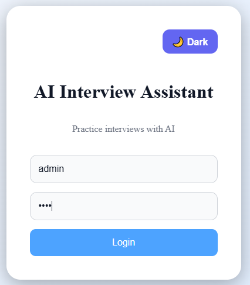
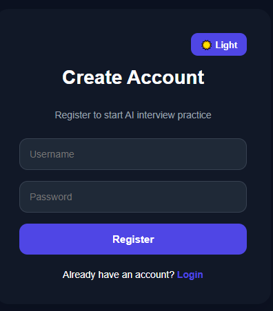
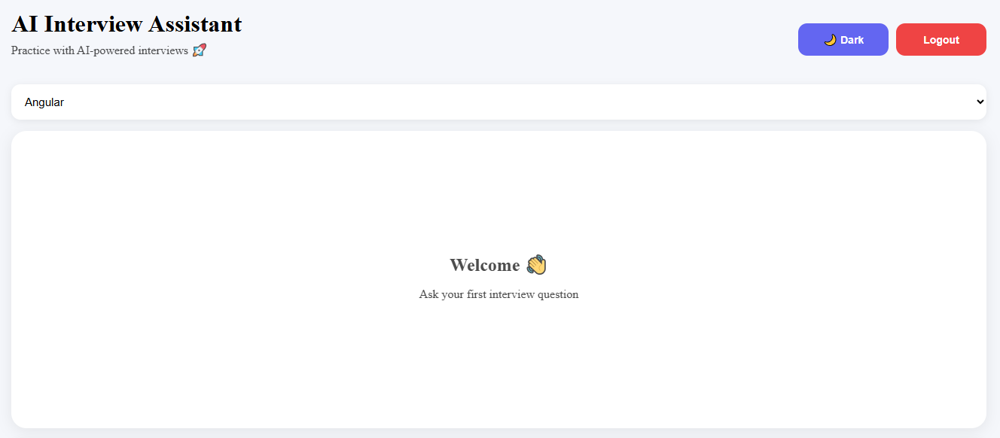
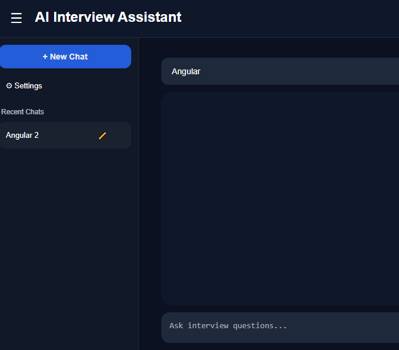
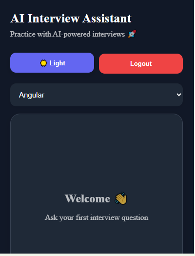
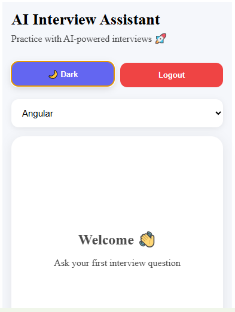

# AI Interview Assistant

An AI-powered interview preparation platform built with Angular, Node.js, Express, and PostgreSQL.

Users can practice technical interview questions, manage multiple chat sessions, review previous conversations, and receive AI-generated responses through an intuitive ChatGPT-style interface.

---

# Features

## Authentication

* User Registration
* User Login
* JWT Authentication
* Protected Routes
* Logout Functionality

## AI Interview Assistant

* AI-Powered Interview Questions
* Multiple Interview Categories
* Real-time Chat Experience
* Copy AI Responses
* Loading Indicator
* Auto Scroll Messages
* Auto Resize Textarea

## Session Management

* Create New Chat Sessions
* Load Previous Sessions
* View Chat History
* Rename Sessions
* Delete Sessions
* Session-based Message Storage

## User Experience

* ChatGPT-style Sidebar
* Responsive Design
* Dark Mode / Light Mode
* Theme Persistence
* Mobile Friendly UI

---

# Technologies Used

## Frontend

* Angular 20
* TypeScript
* HTML5
* CSS3
* RxJS

## Backend

* Node.js
* Express.js
* TypeScript

## Database

* PostgreSQL

## Authentication

* JWT (JSON Web Token)
* bcryptjs

## AI Integration

* OpenRouter API

## DeploymentLive Demo


* Netlify (Frontend) 
-https://ai-interview-assistant-app.netlify.app
* Render (Backend)
-https://ai-interview-assistant-mxh2.onrender.com

---

# Project Structure

```bash
ai-interview-assistant/
│
├── client/
│   ├── src/
│   │   ├── app/
│   │   │   ├── components/
│   │   │   ├── services/
│   │   │   ├── guards/
│   │   │   ├── interceptors/
│   │   │   └── models/
│   │
│   └── package.json
│
├── server/
│   ├── src/
│   │   ├── controllers/
│   │   ├── routes/
│   │   ├── config/
│   │   ├── middleware/
│   │   └── services/
│   │
│   └── package.json
│
├── screenshots/
│
└── README.md
```

---

# Installation

## Clone Repository

```bash
git clone https://github.com/BaeEu/ai-interview-assistant.git
```

---

## Frontend Setup

```bash
cd client

npm install

ng serve
```

Application runs on:

```bash
http://localhost:4200
```

---

## Backend Setup

```bash
cd server

npm install

npm run dev
```

API runs on:

```bash
http://localhost:5000
```

---

# Environment Variables

Create a `.env` file inside the server folder:

```env
OPENROUTER_API_KEY=your_openrouter_api_key

JWT_SECRET=your_jwt_secret

DATABASE_URL=your_postgresql_connection_string
```

---

# API Features

## Authentication

* Register User
* Login User
* JWT Token Generation
* JWT Middleware Protection

## Sessions

* Create Session
* Get User Sessions
* Update Session
* Delete Session

## Messages

* Save Message
* Load Messages by Session
* Clear Session Messages

---

# Screenshots

## Login Page



---

## Registration Page



---

## Chat Interface



---

## Session History



---

## Dark Mode



---

## Mobile Responsive View



---

# Future Enhancements

* Export Chat to PDF
* Search Chat History
* Voice Interview Mode
* AI Interview Scoring
* User Profile Management
* Interview Analytics Dashboard

---

# Author

**Sabal Oo**

Software Developer

* Angular
* TypeScript
* C#
* ASP.NET
* Node.js
* PostgreSQL
